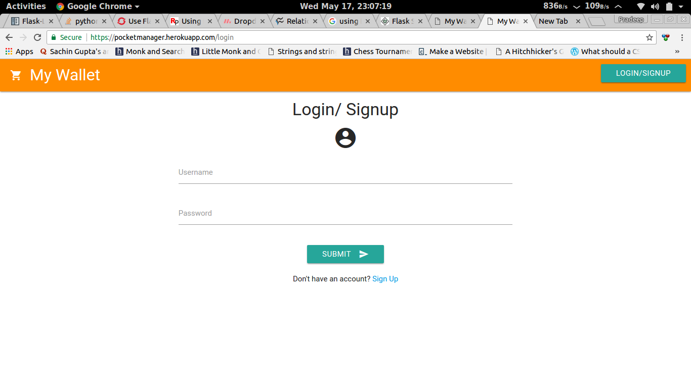
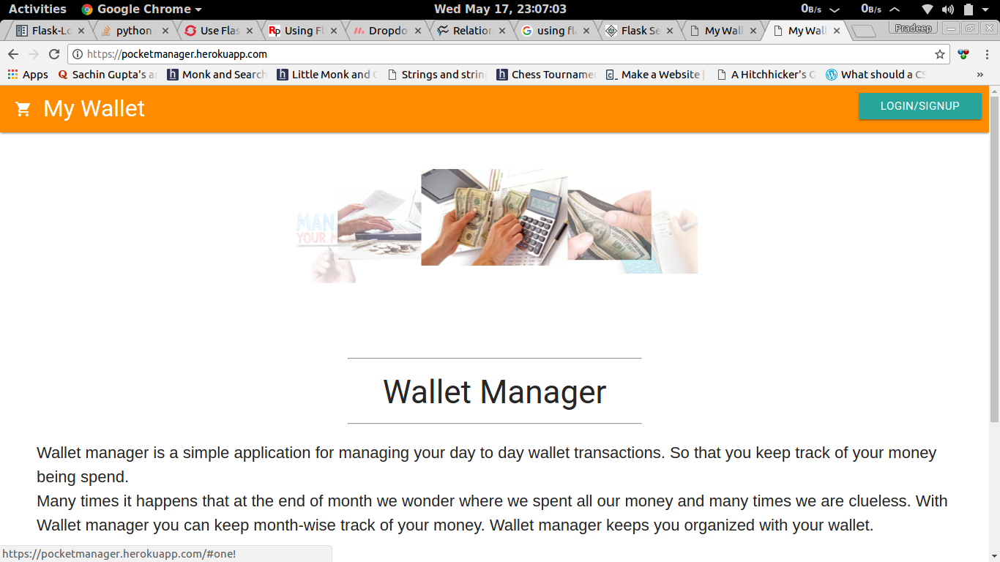

# This is a basic Wallet Manager type application

### This application uses Python based FLASK framework for its backend and Postgresql for database.

#### Site is currently in **Beta Version** hence some functionality are not functional.

#### **Visit** [My Wallet](https://pocketmanager.herokuapp.com) **for live demo**

- Hosting Credits = Heroku
- DataBase = SQLite (Development) Postgresql (Production)
- Framework = Flask (Python)

Some heroku config files have not been added for security. But this repo is ready to clone for local development purpose.
___

### Updates Pending : UI improvement, User interactive sessions, Improved Login.
___

To Get this application running on your local machine

Download this repository as a **zip file** and extract it in the desired directory.

___

**I prefer to use a virtual environment for running this app.
Search online for how to activate virtual environment for your operating system.**

___

After activating virtual environment. Run following commands :

> pip install flask
> 
> pip install sqlalchemy
> 
> python app.py

You are good to go. Browse at *localhost:5000*.

Enjoy! :+1:

